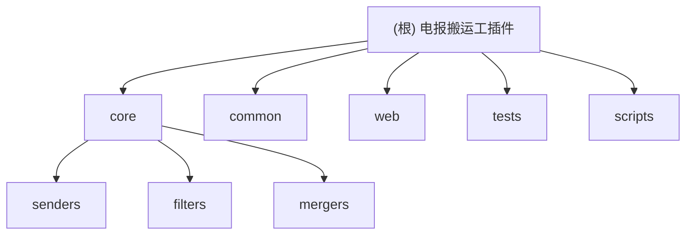

# CLAUDE.md

This file provides guidance to Claude Code (claude.ai/code) when working with code in this repository.

## 变更记录 (Changelog)

- **2026-07-04 (补扫)**: 深入补扫 `relogin.py` 重登流程、`_conf_schema.json` 配置字段、`core/downloader.py` 媒体细节与两份 Web 设计 spec；修正 `core/filters` 接口描述偏差（实际为 `filter_messages` / `filter_keywords` / `filter_regex` 黑名单语义，非 `should_keep` / include/exclude）；新增 4 个独立单测（`test_message_filter` / `test_qq_circuit` / `test_qq_file_fallback` / `test_qq_dispatcher`，共 62 条用例），全量 338 passed。
- **2026-07-04**: 增量补扫。新增 Web 管理界面（`web/` / `core/web_admin.py` / 缓存层）、`scripts/` 构建流水线、`pages/dashboard/` 生成产物识别；补充 `core/mergers/keyword_next` 新合并器；新增 `core/filters/` 与 `core/mergers/` 模块文档；更新模块结构图与索引。
- **2026-06-08**: 进行了全仓自适应清点，更新了项目结构拓扑，新增了模块级别的 Mermaid 图与索引。

## 项目愿景

开发一个高可靠性的 **AstrBot 插件**，用于监控 Telegram 频道的更新，并将其无缝、稳定地转发至指定的 QQ 群（通过 NapCat/OneBot 11 协议）或其他的 Telegram 频道。在网络波动、会话异常、资源限制下保证消息队列的不丢失与有序发送。

并附带一个独立的 **Web 管理控制台**（自托管 Flask 服务 + 原生前端），支持配置编辑、登录态管理、QQ 群/Telegram 频道选择、运行时控制等。

## 架构总览

- **基于框架**: [AstrBot](https://astrbot.app) (`astrbot.api.star.Star`)，版本要求 `>=4.13.0,<5`
- **支持平台**: `aiocqhttp`（QQ / NapCat / OneBot 11）、`telegram`
- **入口**: `main.py` 的 `Main` 插件类
- **核心组件**:
  - `Forwarder` (`core/forwarder.py`): 统筹调度，轮询抓取 Telegram 更新并处理发送队列。
  - `QQSender` (`core/senders/qq.py`): QQ 目标转发的门面，下分 13 个子模块（媒体处理、目标探测、批次分发、失败回退等）。
  - `TelegramClientWrapper` (`core/client.py`): 持久化的 Telethon 客户端封装（含跨重载的 `sys` 级客户端/授权缓存）。
  - `PluginCommands` (`core/commands.py`): `/tg` 命令组的命令处理。
  - `WebAdminServer` (`core/web_admin.py`): 独立 Flask Web 管理服务（默认 `127.0.0.1:8180`）。
  - `QQGroupCache` / `TGChannelCache`: 带 TTL 的平台列表缓存（供 Web 选择器使用）。
- **调度**: APScheduler 双 job（`check_updates` / `send_pending_messages`），启动后有 30s grace period。

## 模块结构图



## 模块索引

| 模块 | 路径 | 职责说明 | 文件数 | 覆盖率 |
| --- | --- | --- | --- | --- |
| 根入口 | `main.py` | `Main` 插件类、Dashboard Web API 路由注册、`/tg` 命令注册 | 2 | 高 |
| `core/` | 核心业务 | 抓取、指令、队列分发、客户端管理、Web 管理后端、平台缓存 | 8 | 高 |
| `core/senders/` | 平台发送 | QQ 门面及 13 个子模块（媒体/熔断/分发/回退/日志等），Telegram 直发 | 14 | 高 |
| `core/filters/` | 过滤引擎 | `MessageFilter` 基于 `filter_keywords` / `filter_regex` 的黑名单过滤（命中即丢弃） | 2 | 高 |
| `core/mergers/` | 合并策略 | `MessageMerger` + `SomeACGPreviewPlusOriginal` + `KeywordNextNMerge` | 5 | 高 |
| `common/` | 通用工具 | `Storage`（原子写）、`text_tools`（频道名规范化/Telethon 实体解析） | 3 | 高 |
| `web/` | Web 前端源 | 唯一手改前端（HTML/CSS/JS 模块化 + 本地 GSAP），可直接 `127.0.0.1:8180` 服务 | 15 | 高 |
| `tests/` | 测试套件 | 15 个 test 文件 + 极深 mock 的 `conftest.py` | 16 | 高 |
| `scripts/` | 构建工具 | `build_frontend.py` 把 `web/` 编译为 `pages/dashboard/` 沙箱产物 | 3 | 高 |
| `pages/dashboard/` | 生成产物 | **禁止手改**：AstrBot 插件页沙箱，由 `scripts/build_frontend.py` 生成 | 17 | 跳过 |

## 运行与开发

```bash
# 重新登录 / 生成会话
python relogin.py

# 前端：web/ 是唯一手改源，pages/dashboard/ 是生成产物（禁止手改）
python scripts/build_frontend.py          # 改完 web/ 或 scripts/dashboard_overrides/ 后重新生成
python scripts/build_frontend.py --check  # 校验产物同步（pytest 强制此门禁）

# 格式化与检查
ruff format .
ruff check --fix .

# 单元测试
pytest tests/ -v --cov=. --cov-report=term-missing
```

Web 管理界面默认监听 `http://127.0.0.1:8180`（可在 `_conf_schema.json` / 插件配置中改 `web.enabled` / `web.host` / `web.port` / `web.token`）。

## 测试策略

- **测试框架**: `pytest`（`conftest.py` 内置 asyncio 兼容回退，即使无 `pytest-asyncio` 也能跑）
- **最小覆盖率**: 80%（使用 `--cov-report=term-missing`）
- **Mock 深度**: `conftest.py` 通过 `sys.modules` 直接 mock 掉 `telethon`、AstrBot 内部模块等，避免测试过程中的网络连接与环境依赖
- **前端门禁**: `tests/test_web_frontend_assets.py` 验证 `pages/dashboard/` 与 `web/` 同步（CI 必过）
- **覆盖范围**:
  - QQ 发送链路：`test_qq_sender.py`、`test_qq_log_policy.py`、`test_qq_circuit.py`、`test_qq_dispatcher.py`、`test_qq_file_fallback.py`
  - 消息过滤：`test_message_filter.py`
  - 抓取调度：`test_forwarder_send_pending.py`
  - 持久化：`test_storage_pending_retry.py`
  - 客户端会话：`test_client_session_schema.py`、`test_relogin.py`
  - 命令：`test_commands_debug.py`
  - 合并：`test_keyword_next_merge.py`
  - 下载：`test_downloader.py`
  - Web 管理后端：`test_web_admin.py`
  - 前端产物同步：`test_web_frontend_assets.py`

## 编码规范

- **异步模式**: 必须全异步，严禁使用 `requests`，推荐 `aiohttp` 或 `httpx`（详见 `.claude/rules/async-patterns.md`）。
- **格式化**: `ruff format .` 然后 `ruff check --fix .`，行宽 120，Python 3.12+（详见 `.claude/rules/code-style.md`）。
- **配置与数据**: 持久化数据存于 `data/plugin_data/astrbot_plugin_telegram_forwarder/`（原子写 `Storage.save()`），以防更新时丢失；严禁放插件自身目录。
- **长文件分割**: 如 `qq_dispatcher.py` / `qq_targets.py` 均为复杂热点逻辑，避免将一切全压入 `qq.py`。
- **模块独立性**: 发送节点、合并策略应当支持插拔；新增媒体发送功能优先参考 `core/senders/qq_media.py`。

## AI 使用指引

- **遵循局部覆盖**: 许多复杂设计已有完整 spec（见 `docs/superpowers/specs/`），修改前请查阅相关设计文档。
- 绝不随意重构 `core/senders/` 下已被细分的模块（合并降级、重试回退、目标熔断逻辑均经过实战调优）。
- 开发中如果增加新的媒体发送功能，优先参考 `core/senders/qq_media.py` 的路径映射与 `_patch_file_to_dict` 修补。
- Web 前端改动只在 `web/` 内进行；改完务必 `python scripts/build_frontend.py` 同步到 `pages/dashboard/`，否则 `test_web_frontend_assets.py` 会失败。
- Web 管理相关设计参考 `docs/superpowers/specs/2026-07-01-web-admin-qq-group-selection-design.md` 与 `docs/superpowers/specs/2026-07-02-frontend-optimization-design.md`。

## 相关文件清单

- `main.py` — 插件入口、Web API 路由表（27 条）、`/tg` 命令组（13 条）
- `relogin.py` — Telegram 重新登录工具
- `metadata.yaml` — v0.9.0，作者 HSJ-BanFan&Foolllll
- `requirements.txt` — apscheduler / telethon>=1.42.0,<1.43.0 / pysocks / flask
- `_conf_schema.json` — WebUI 可编辑配置 schema
- `README.md` / `CHANGELOG.md`
