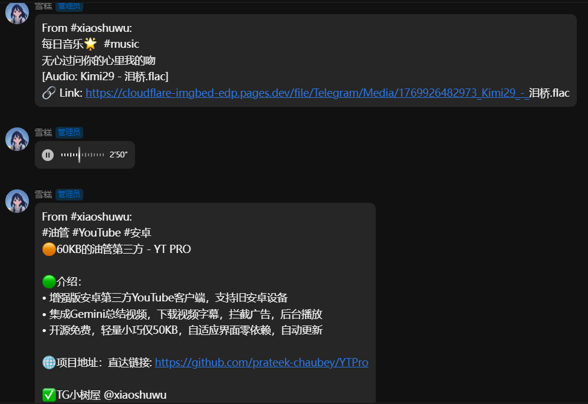

# ✈️ 电报搬运工

<i>🚛 我们只是电报的搬运工</i>

## 📖 简介

一款为 [AstrBot](https://astrbot.app) 设计的功能强大的 Telegram 消息转发插件。它支持自动监控指定的公开频道，并将其中的文字、图片、音频及文件实时同步至您的 QQ 群或另一个 Telegram 频道。

---

## ✨ 功能特性

* **🌐 多平台同步**
  * 支持转发至 **QQ 群** (通过 NapCat/OneBot 11)。
  * 支持转发至 **Telegram 频道** (通过 Telethon 会话转发)。
* **📦 全媒体类型支持**
  * **图文消息**: 自动识别并保持格式同步。
  * **音频/文件**: 支持常见媒体与文件类型搬运。
* **🛠️ 高级控制逻辑**
  * **灵活过滤**: 内置关键词黑名单与正则表达式过滤引擎。
  * **冷启动支持**: 可指定历史日期开始搬运。在频道设置中指定 `start_time` (格式: YYYY-MM-DD) 即可。
  * **转发查重**: 自动识别频道间的转发关系，避免监控多个关联频道时出现重复消息。
  * **协议登录**: 使用 Telethon 客户端登录，支持转发您已加入的所有频道。

---

## 🚀 效果预览

---

## ⚙️ 配置说明

### 1. 账号连接
* **phone**: **(必填)** 您的 Telegram 登录手机号 (国际格式，如 `+86138...`)。
* **api_id** / **api_hash**: **(必填)** Telegram API 凭证 (需从 [my.telegram.org](https://my.telegram.org) 获取)。
* **proxy**: 代理地址，例如 `http://127.0.0.1:7890`。
* **telegram_session**: **(推荐)** 您可以在本地使用 `relogin.py` 生成 `.session` 文件并在此处上传，以绕过 Docker 环境下的验证码输入问题。

### 2. 获取登录 Session
由于 Docker/后台环境无法直接输入验证码，或因服务器网络环境触发人机验证（Cloudflare 等）导致登录失败，请按以下步骤在本地环境中生成会话文件：
1. 进入插件目录：`cd data/plugins/astrbot_plugin_telegram_forwarder`
2. 运行登录工具：`python relogin.py` (请确保已安装依赖)
3. 按提示输入手机号与验证码，生成的 `user_session.session` 会自动保存至数据目录。
4. 重启 AstrBot 即可生效。

> **提示**：如果机器人的网络环境被 Telegram 要求人机验证而无法登录，您可以将此工具下载到本地电脑，更换网络环境运行成功后再将生成的 `.session` 文件上传至插件数据目录。

### 3. 目标平台配置
* **QQ 配置**:
  * `target_qq_group`: 接收消息的 QQ 群号列表。
  * `napcat_api_url`: NapCat API 地址。若设为 `localhost`，则使用 AstrBot 内部接口发送（推荐）。
* **Telegram 配置**:
  * `target_channel`: 接收消息的目标频道 ID。

### 4. 源频道配置
您可以为每个频道进行精细化设置：
* **channel_username**: 频道用户名 (不带 @)。
* **target_qq_groups**: 填写则覆盖全局 QQ 目标群号 留空使用全局配置。
* **start_time**: 起始日期 (YYYY-MM-DD)。留空则仅转发新消息。
* **check_interval**: 专属检测间隔。为 0 时使用全局配置。
* **priority**: 转发优先级。数值越大优先级越高。未设置或为 0 时优先级最低。高优先级频道的消息将优先于低优先级频道发送。
* **forward_types**: 选择需要搬运的类型 (文字/图片/视频/音频/文件)。
* **max_file_size**: 单个文件大小限制 (MB)，0 表示不限制。
* **ignore_global_filters**: 开启后，该频道将**忽略全局**的 filter_keywords 和 filter_regex（但仍执行本频道自己的过滤规则）。常用于白名单式频道或重要通知频道。
* **filter_spoiler_messages**: 是否过滤遮罩/剧透消息（支持继承全局配置）。
* **monitor_keywords**: 监听关键词。命中后会立即触发转发。
* **monitor_regex**: 监听正则。命中后会立即触发转发。

### 5. 全局转发配置
* **qq_merge_threshold**: QQ 大合并：本次要发的消息数 >= 此值时，全部打包成一条合并转发消息。设为 ≤1 则永不触发大合并。推荐 5~10
* **use_channel_title**: 是否在消息头部显示频道名称。
* **enable_deduplication**: 是否启用转发查重。开启后，如果频道 A 转发了频道 B 的消息，且频道 B 也在监控列表中，则频道 A 的这条转发消息将被自动跳过。
* **exclude_text_on_media**: 开启后，包含媒体的消息将不再发送文本内容（包含 From 头部）。
* **filter_spoiler_messages**: 过滤 Telegram 遮罩/剧透消息（文本剧透实体与媒体剧透标记）。
* **batch_size_limit**: 每次转发执行时，单次处理的消息批次上限。
* **send_interval**: 轮询待发送队列并执行转发任务的周期。
* **retention_period**: 消息在队列中的最大保留时间，过期将自动丢弃。
* **curfew_time**: 宵禁时间段 (格式：`11:11-14:12`)。在此时间段内，插件将停止抓取新消息和转发任务。支持跨天（如 `23:00-07:00`）。留空则禁用。
* **monitor_keywords**: 全局监听关键词。与频道监听关键词做并集，命中后立即触发转发。
* **monitor_regex**: 全局监听正则。与频道监听正则共同生效，命中后立即触发转发。

---

## 💡 常见问题

* **Q: 音频链接不显示？**
  * **A**: 插件会将外链和语音分两条消息发送，请检查消息是否被群管屏蔽。
* **Q: 大文件发送失败？**
  * **A**: 请先确认 `forward_types` 和 `max_file_size` 配置，以及目标平台本身的消息限制。
* **Q: 数据存放在哪里？**
  * **A**: 所有登录会话与配置均持久化在 `data/plugin_data/astrbot_plugin_telegram_forwarder/` 目录下，更新插件不会丢失。

---

## ❤️ 支持

* [AstrBot 帮助文档](https://astrbot.app)
* 如果您在使用中遇到问题，欢迎提交 [Issue](https://github.com/HSJ-BanFan/astrbot_plugin_telegram_forwarder)。

---

**觉得好用的话，给个 ⭐ Star 吧！**

