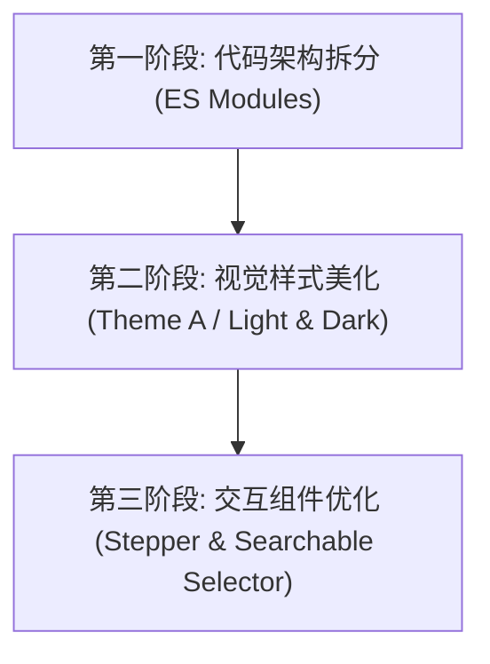

# Telegram Forwarder 插件 Web 前端优化设计方案 (Design Spec)

本文档定义了 `astrbot_plugin_telegram_forwarder` 插件内置 Web 管理后台的前端优化技术方案。方案包含代码架构重构、视觉样式重塑以及关键 UX 交互组件升级。

---

## 1. 优化目标与分阶段计划

前端升级将分为三个相互衔接的阶段实施，以保证修改的稳定性和可测试性：



### 1.1 第一阶段：代码架构拆分与模块化 (Architecture)
*   **痛点**：目前 `app.js` (1600+行) 与 `style.css` (1000+行) 均堆积在单文件中，高度耦合，难以维护。
*   **方案**：在不改变现有功能的前提下，利用原生 **ES6 Modules** 和 **CSS @import** 进行物理拆分。不引入外部编译打包工具 (Vite/Webpack)，保持轻量极简。

### 1.2 第二阶段：视觉样式与智能光暗切换 (Visual & Theme A)
*   **主色调**：以 Telegram 经典明亮浅蓝 (`#31a8e8` / `#0088cc`) 与 QQ 经典浅蓝 (`#12b7f5`) 为主线，辅以柔和微阴影。
*   **暗黑模式**：引入 `prefers-color-scheme` 自动跟随系统，并支持手动切换，使用 CSS 自定义变量 (`var(--bg)`, `var(--panel)` 等) 进行响应式配色。
*   **可视化数据**：优化“总览”指标展示，将无序指标改写为富有层次感的面板，并在可能的情况下运用轻量级 CSS/SVG 状态条展示当前待发送队列水位。

### 1.3 第三阶段：深度交互与组件 UX 优化 (UX Components)
*   **一体化登录 Stepper**：重构 Telegram 多步登录，用连接线引导（1. 连接 -> 2. 验证码 -> 3. 两步验证），支持回退、等待 Loading 态及出错处理。
*   **带搜索过滤的群组/频道选择器**：在双向选择器顶部增加模糊过滤输入框，支持拼音或数字 ID 匹配，并引入快速全选与清除。
*   **频道操作简化**：在频道卡片 Summary 栏直接引入“启用/禁用”拨动开关 (Switch)，无需展开即可更改状态。

---

## 2. 详细技术方案

### 2.1 目录结构拓扑 (Phase 1)
优化后的物理结构分布如下：

```
web/
├── index.html                   # 主入口，script 改为 type="module"
└── assets/
    ├── css/
    │   ├── variables.css        # 主题色彩变量与光暗定义
    │   ├── base.css             # 全局排版与 App Shell 布局
    │   ├── components.css       # 按钮、面板、选择器组件样式
    │   └── section-channels.css # 频道编辑专属响应式样式
    ├── js/
    │   ├── api.js               # 封装所有 API 请求 (fetch)
    │   ├── store.js             # 简易中心化 Store 状态流管理
    │   ├── utils.js             # 辅助工具函数 (HTML 转义等)
    │   ├── ui_overview.js       # 总览页面与操作日志控制
    │   ├── ui_login.js          # TG 登录 Stepper 控制器
    │   ├── ui_channels.js       # 频道与合并规则动态渲染
    │   └── ui_selector.js       # QQ/TG 可搜索选择器事件绑定
    ├── style.css                # 样式主入口，只含 @import "css/*.css"
    └── app.js                   # 脚本主入口，负责路由初始化与各模块组装
```

### 2.2 JS 状态中心化管理 (`store.js`)
为避免 DOM 与 API 回调直接耦合，引入极简 Store 模式：

```javascript
// js/store.js
export const store = {
  state: {
    token: localStorage.getItem("telegram_forwarder_token") || "",
    config: null,
    status: null,
    activeSection: "overview",
    expandedChannels: new Set(),
  },

  listeners: [],

  subscribe(fn) {
    this.listeners.push(fn);
  },

  updateState(changes) {
    this.state = { ...this.state, ...changes };
    this.listeners.forEach(fn => fn(this.state));
  }
};
```

---

## 3. UI 交互规格定义

### 3.1 TG 登录 Stepper 状态流
Stepper 对应以下 3 种步骤状态（由后端 `/api/login/status` 同步状态机维持）：
1.  **CONNECT**：录入 `api_id`, `api_hash`, `phone`, `proxy`。点击“发送验证码”进入 `CODE`。
2.  **CODE**：输入 5 位验证码。点击提交，失败展示 Error 框，成功则在无 2FA 情况下直接登录，有 2FA 时进入 `PASSWORD`。
3.  **PASSWORD**：输入两步验证密码。

**状态转换图**：
```
[步骤1: CONNECT] --(API 成功)--> [步骤2: CODE] --(有2FA)--> [步骤3: PASSWORD]
       ^                           | (无2FA)                | (成功)
       +--------(点击返回/取消)-----+-------------------------v---------> [登录成功]
```

### 3.2 过滤选择器模糊匹配算法
在 `ui_selector.js` 中引入，每次输入框触发 `input` 事件时，执行原地过滤渲染：

```javascript
function filterList(query, listItems) {
  const normQuery = query.toLowerCase().trim();
  return listItems.filter(item => {
    const name = (item.name || "").toLowerCase();
    const id = String(item.id || "");
    return name.includes(normQuery) || id.includes(normQuery);
  });
}
```

---

## 4. 容错与异常处理

1.  **API 请求超时保护**：封装 `fetch` 时设定最大 30 秒超时（登录等长链接 API 为 60 秒），超时自动弹出提示，不卡死按钮。
2.  **网络离线感知**：若 API 轮询 `/api/status` 连续失败 3 次，页面顶部悬浮展示 “与插件服务连接中断，正在尝试重连...” 的警告条。
3.  **Token 失效拦截**：当任何 API 返回 `410` 或 `401` 错误时，清空 localStorage 的 Token，平滑切换回登录认证界面，并提示“登录已过期”。

---

## 5. 测试与验证策略

1.  **无打包工具本地测试**：直接通过 AstrBot 插件运行内置 Flask 服务器加载页面，验证静态文件请求在控制台中无 MIME-type 报错（由于 ES Modules 要求严格，必须确保 HTTP Header `Content-Type: application/javascript` 正确返回）。
2.  **响应式布局测试**：
    *   桌面端 (>=1200px)：双栏布局（Sidebar 固左，内容固右）。
    *   平板端 (820px - 1199px)：卡片流，选择器变单栏。
    *   移动端 (<820px)：Sidebar 折叠为移动汉堡菜单，悬浮 Topbar 动作按钮。
3.  **核心状态功能自检**：
    *   新建频道配置后，各项修改是否在点击“保存”时正确打包成 JSON 回传。
    *   导入非法 JSON 配置时的防崩溃保护。
